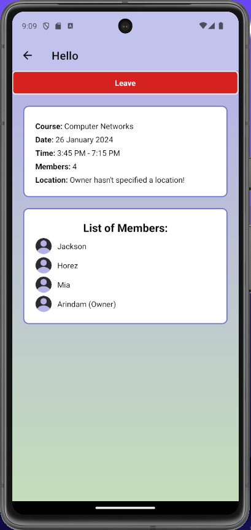
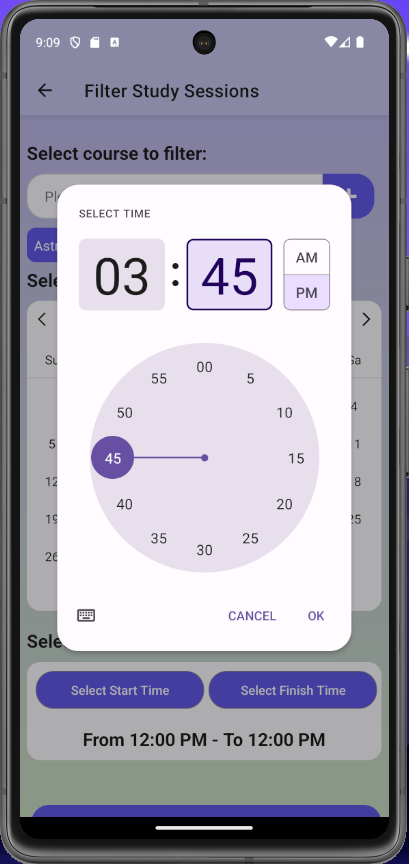
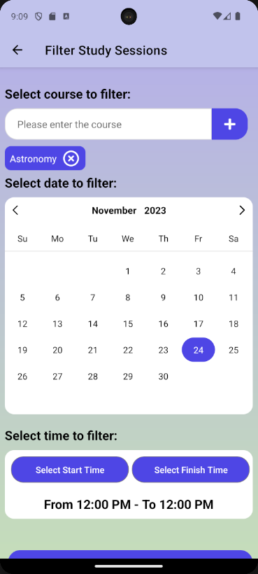
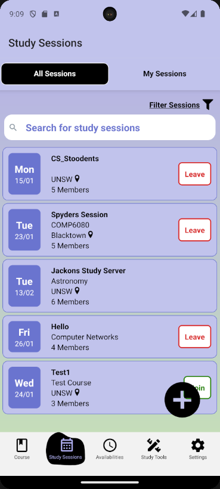

# Study Sphere

Study Sphere is a mobile application designed to facilitate collaborative studying among peers. Built using React Native and Expo, it offers a platform for students to connect, organize study groups, and utilize various tools for efficient learning.

## Features

- **User Authentication:** Sign up and log in securely to access the application features.
- **Study Groups:** Create or join study groups based on subjects, courses, or interests.
- **Real-time Collaboration:** Chat functionality within study groups for seamless communication.
- **Shared Tools:** Integrated tools such as shared whiteboards, document collaboration, and scheduling tools.
- **Resource Sharing:** Share study materials, resources, and notes with group members.

## Getting Started

### Prerequisites

- Node.js and npm installed on your machine.
- Expo CLI installed in your machine

### Installation

1. Clone the repository: `git clone https://github.com/Ascendrospyder/Study-Sphere.git`
2. Navigate to the project directory: `cd study-sphere`
3. Install dependencies: `npm install` or `npx expo install`

### Running the App

- Run the Expo development server: `npx expo start`
- Use the Expo Go app on your mobile device to scan the QR code from the Expo developer tools in your browser.

## Screenshots

## Technologies Used

- React Native
- Expo

## Authors

- [Arindam](https://github.com/Ascendrospyder)
